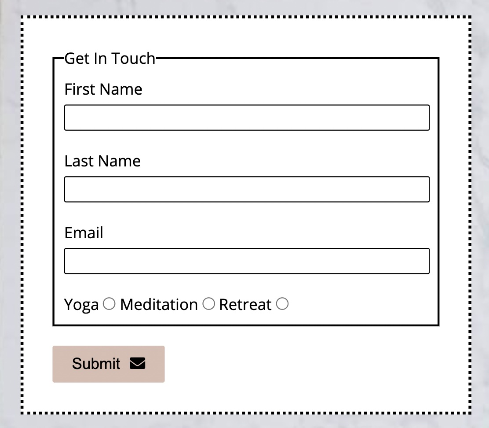
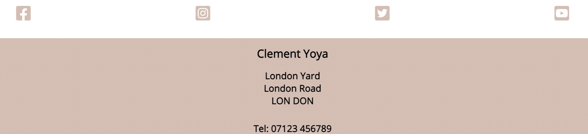

# Clement Yoga

The Clement Yoga website is a website for people looking to practice yoga, either in a class environment, online at home or in a private one to one setting.  
Clement Yoga also offers personalied meditation techniques and yoga retreats to its clients.

Users of the site will be able to see the services which Clement Yoga offer, along with a step by step simple meditation techique to follow at home and a contact page to get in touch for further details.

# Site Design Considerations
### Client Expectations

The basic functions requested by the client were:
- Picture examples of the kinds of practices offered
- A simple meditation demonstration to give potiental clients some information to take away from the site which could be built upon should they wish to join
- Links to all social media channels as currently most clients are directed to the business from these
- Contact page

The client would like to have the ability to add further functionality at a later point to include a class timetable for yoga classes, an online booking form for yoga classes and a deciated retreat page to demonstarte past retreat events. 

The client would like the website to convey a welcoming, serene and tranquil tone, focusing on using cool pink and grey based hues.

### User Expectations
- User to be able to quickly and easily understand to purpose of the site
- User to be able to find simple navigation around the website
- User to be able to locate business contact details
- User to be able to locate business social media links
- User to be able to contact the business without leaving the site and using an external source
- User to be able to view the site across an aray of divices without loss of functonality
- A user with disabilities will be able to navigate the site freely without obstruction

### Colour Scheme and Font

### Wireframes

Homepage

Technique Page

Contact Page

# Features

Navigation Bar and Landing Page
- The navigation bar features at the top of all three pages of the site and is fully responsive.
- The uniform styling aims to link all pages together for a seamless, fulid feel.
- The bar contains links to all other pages across the site.
- The landing page image has been used to imediatly demonstrate what the website can offer and a circle image of text has also been added to summarise all services available.
- Further down the page there are three images to promote the three types of services available to the user. Each image has been picked as it provides a clear visual description of the service along with a breif text underneath. Each image has a hover effect which when clicked takes the user to the contact page form.

Techniques Page
- The techique page provides a simple step by step mediation practice for the user to copy at home. There are five images each with accompaning text detailing how to carry out the techiques.
- Going forward, this could be regularly updated and changed to different techniques to provide newness to the site.

Contact Page
- The contact page has a contac form for users to input their name and email address. Users must also choose which service they are intrested in being contacted about by selecting either Yoga, Meditaton or Retreat. 
- The page also features a background image with a zoom effect to add another level of interest for the user and to provide a more special styling experience.

Footer
- The footer contains icons to the comapny's social media pages which all open in a seperate window. They also have a hover effect to improve the user experience.
- The footer contains contact details for the company, including a location address and telephone number.

# Testing

# Bugs

# Validator Testing

# Deployment

# Credits

# Media
 - All fonts came from [Google Fonts](https://fonts.google.com/) 
 - All images came from [Pexels](https://www.pexels.com/)
 - All icons came from [Font Awesome](https://fontawesome.com/)
